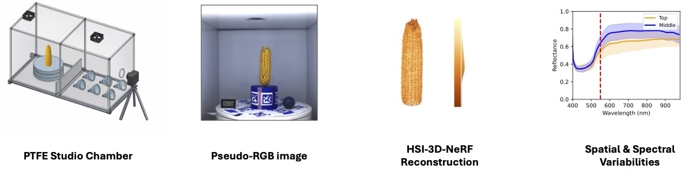

# HSI-SC-NeRF: NeRF-based Hyperspectral 3D Reconstruction using a Stationary Camera for Agricultural Applications

## Overview

HSI-SC-NeRF is a stationary-camera-based hyperspectral NeRF framework for 3D plant phenotyping and postharvest agricultural inspection. It extends our earlier **SC-NeRF** framework for stationary-camera point cloud reconstruction, introduced in our CVPR 2025 Workshop paper, “[SC-NeRF: NeRF-based Point Cloud Reconstruction using a Stationary Camera for Agricultural Applications](https://openaccess.thecvf.com/content/CVPR2025W/V4A/html/Ku_SC-NeRF_NeRF-based_Point_Cloud_Reconstruction_using_a_Stationary_Camera_for_CVPRW_2025_paper.html).” 

Built on top of [Nerfstudio](https://github.com/nerfstudio-project/nerfstudio), HSI-SC-NeRF extends that stationary-camera formulation to hyperspectral 3D reconstruction within a modular and scalable framework for training, rendering, and exporting neural radiance field models. Unlike conventional NeRF pipelines that require camera motion around a static object, this framework uses a fixed camera and a rotating object, enabling a simpler and more practical acquisition setup under controlled imaging conditions.

<p align="center">
  
</p>

This repository provides code and commands for:

1. **Pose estimation** from pseudo-RGB images using COLMAP
2. **Hyperspectral NeRF training**
3. **Evaluation** of reconstruction quality
4. **Export** of hyperspectral 3D point clouds

## Dataset

The dataset associated with this project is publicly available on Hugging Face:

[HSI-SC-NeRF Dataset](https://huggingface.co/datasets/BGLab/HSI-SC-NeRF)

Please refer to the dataset card for details on the imaging setup, spectral calibration workflow, directory structure, and released reconstruction outputs.

## Pipeline

### 1. Pose Estimation (COLMAP) using pseudo-RGB images

```bash
time ns-process-data images \
--data <INPUT_IMAGE_DIR> \
--output-dir <PROCESSED_OUTPUT_DIR> \
--sfm-tool colmap     --matching-method sequential     --feature-type any     --matcher-type any \
--use-single-camera-mode     --same-dimensions     --no-refine-intrinsics     --camera-type simple_pinhole     --num-downscales 3
```

### 2. Train HSI NeRF

```bash
ns-train nerfacto \
--data <PROCESSED_OUTPUT_DIR> \
--output-dir <TRAIN_OUTPUT_DIR> \
--pipeline.model.num-output-channels <NUM_HSI_CHANNELS> \
--pipeline.model.predict-normals True     --viewer.quit-on-train-completion True \
--pipeline.model.far_plane <FAR_PLANE>     --pipeline.model.near_plane <NEAR_PLANE> \
--pipeline.datamanager.pixel-sampler.max-num-iterations <SAMPLER_MAX_ITERS> \
--pipeline.model.camera-optimizer.mode <CAMERA_OPTIMIZER_MODE> \
--pipeline.model.hsi_loss_mult <HSI_LOSS_WEIGHT>     --pipeline.model.angular_loss_mult <ANGULAR_LOSS_WEIGHT> \
--max-num-iterations <MAX_ITERS>
```

### 3. Evaluation

```bash
ns-eval \
--load-config <CONFIG_YML_PATH> \
--output-path eval_metrics.json
```

### 4. Export Hyperspectral Point Cloud

```bash
ns-export hsi-pointcloud \
--load-config <CONFIG_YML_PATH> \
--output-dir <POINTCLOUD_OUTPUT_DIR> \
--num-points <NUM_POINTS>
```

## Notes

- Replace placeholder paths such as `<INPUT_IMAGE_DIR>` and `<CONFIG_YML_PATH>` before running.
- Make sure the processed dataset and config paths match your local setup.
- Adjust the number of output channels to match your hyperspectral data.

## Citation

If you use this code or dataset in your research, please cite the corresponding paper.

```bibtex
@article{ku2026hyperstationarynerf,
  title   = {HSI-SC-NeRF: NeRF-based Hyperspectral 3D Reconstruction using a Stationary Camera for Agricultural Applications},
  author  = {Ku, Kibon and Jubery, Talukder Z. and Krishnamurthy, Adarsh and Ganapathysubramanian, Baskar},
  year    = {2026},
  journal = {arXiv preprint arXiv:2602.16950}
}
```
